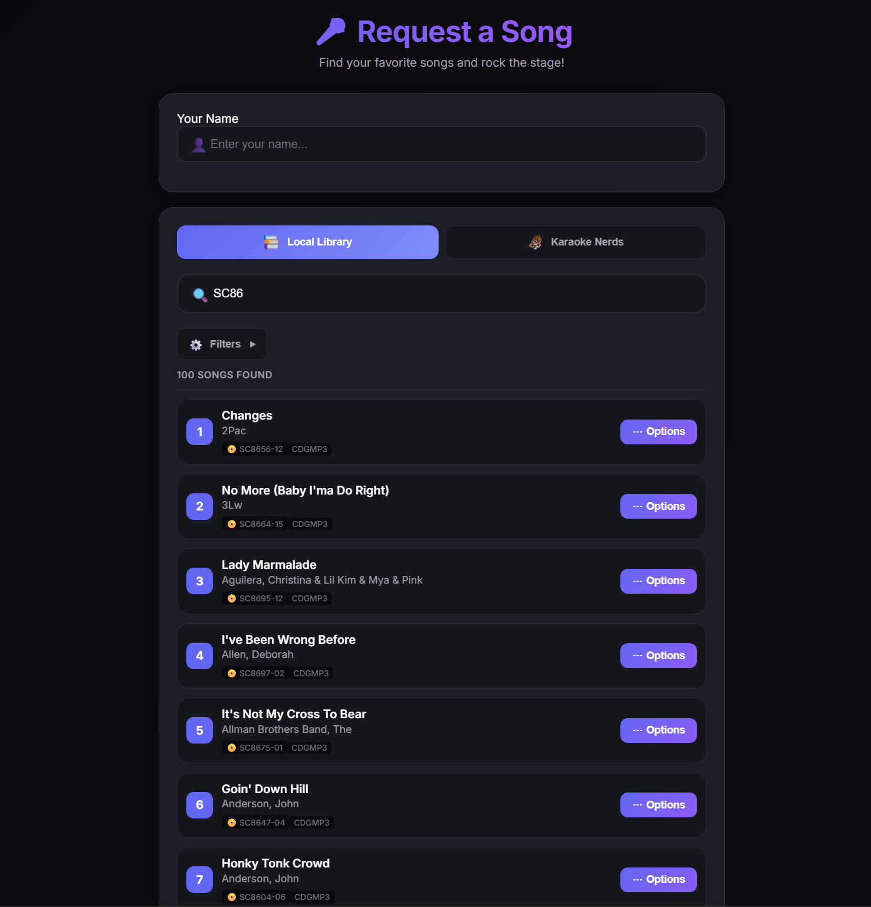
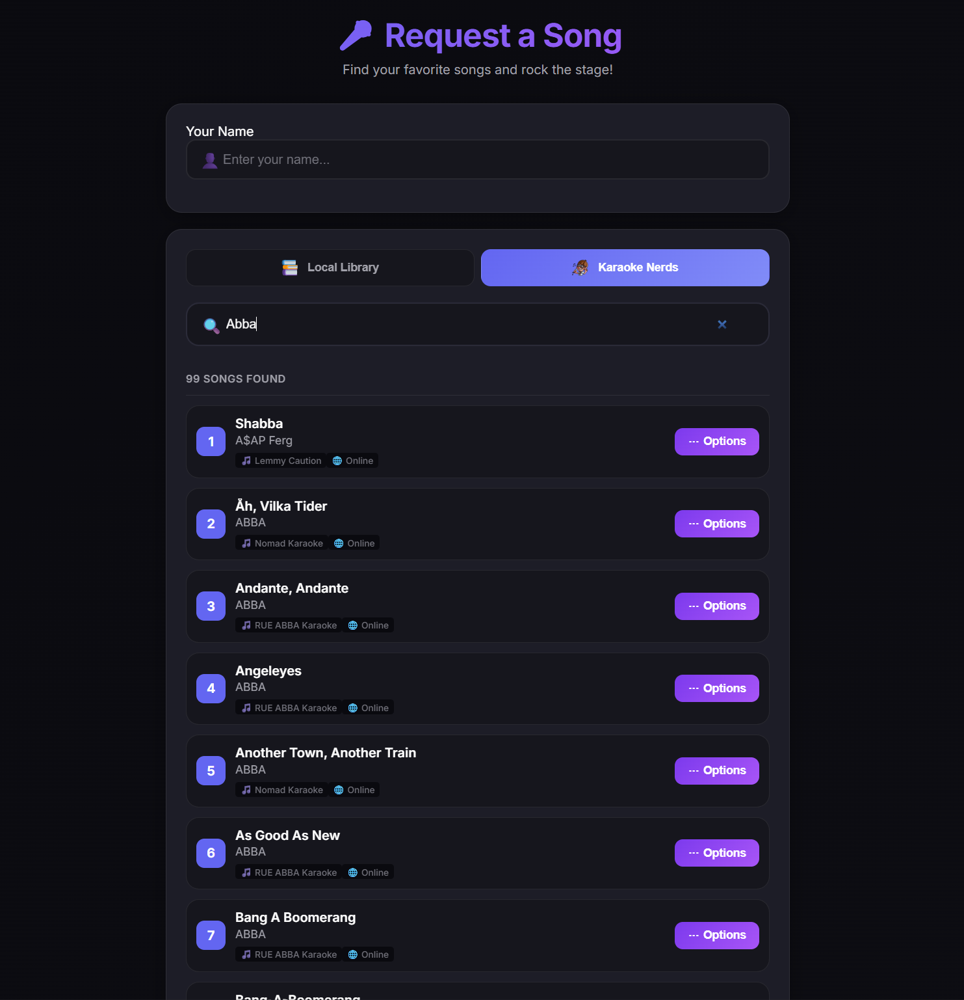
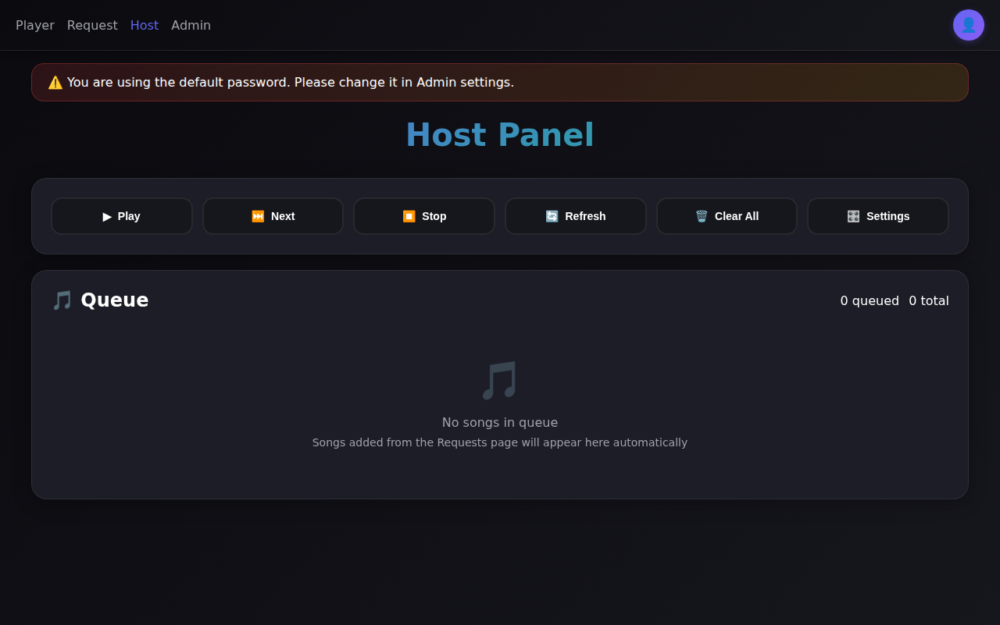
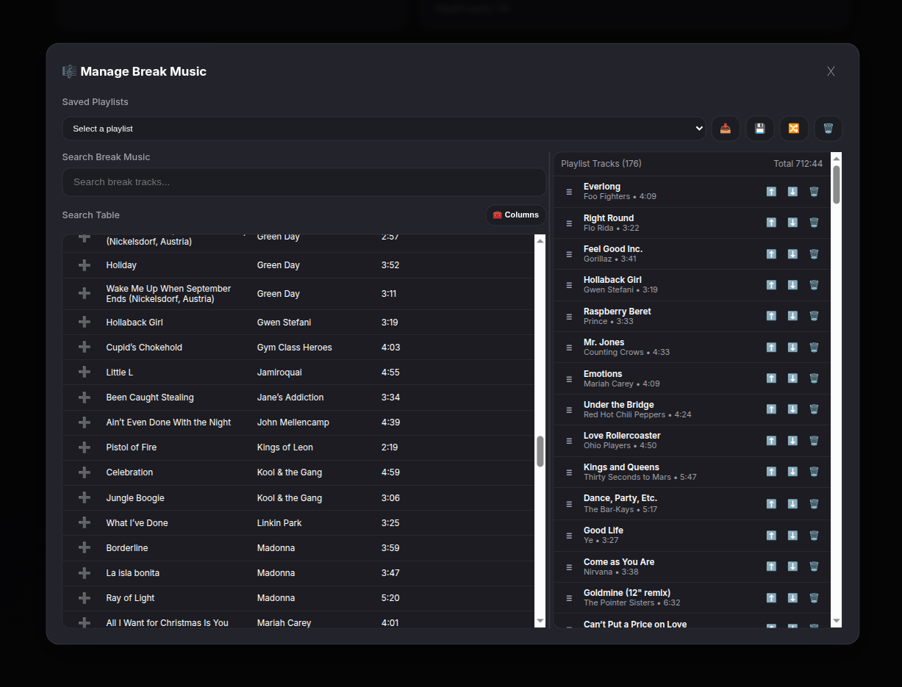
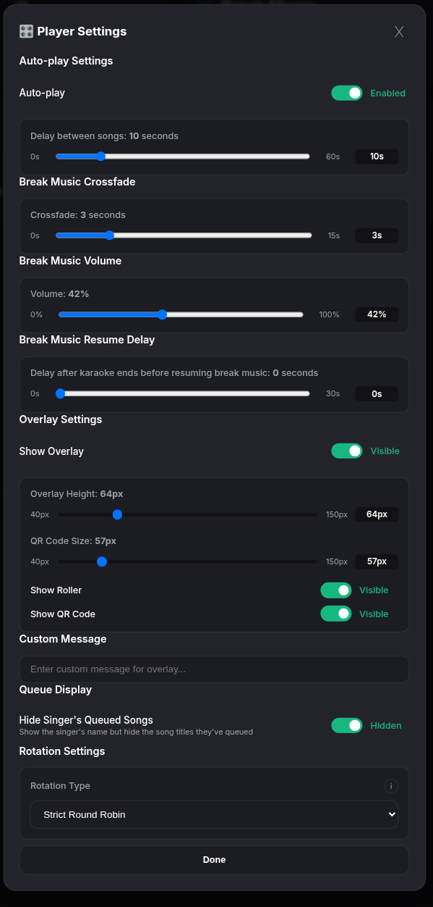
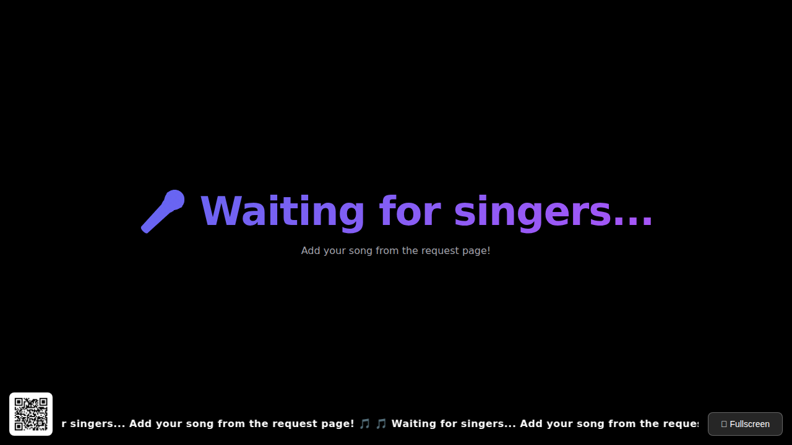
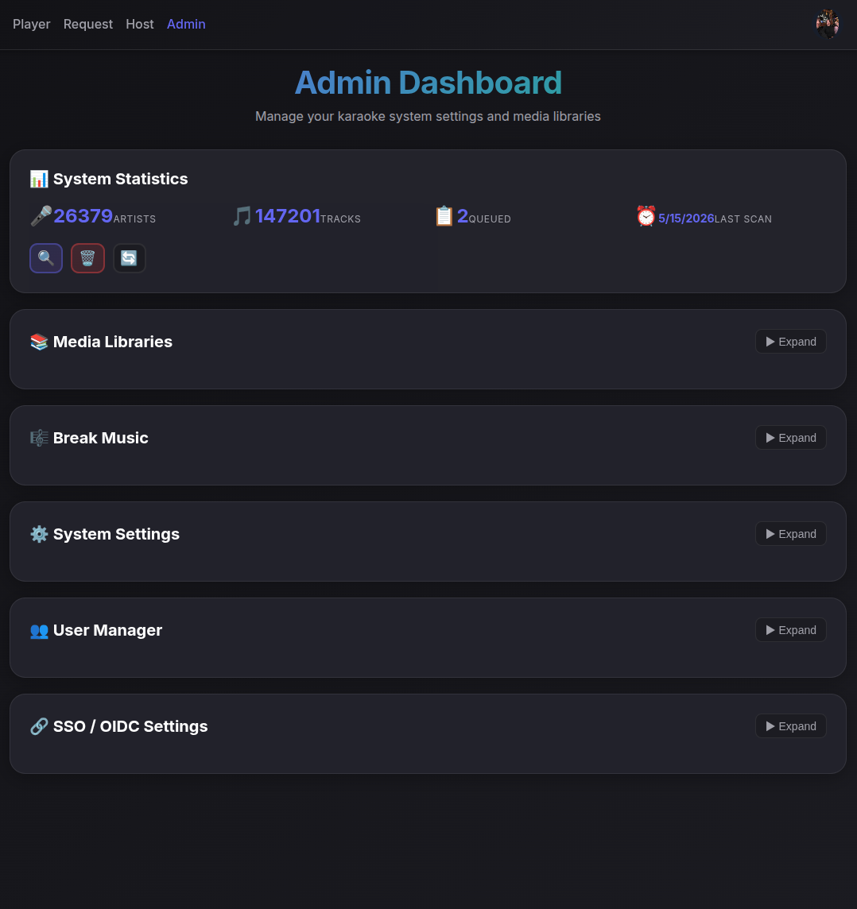

# KaraokeDock

A modern, full-featured web-based karaoke system with support for multiple media formats, real-time queue management, and external karaoke integration.


##  Table of Contents

- [Features](#features)
- [Web Pages Overview](#web-pages-overview)
- [Quick Start with Docker](#quick-start-with-docker)
- [First-Time Setup](#first-time-setup)
- [Architecture](#architecture)
- [Development](#development)
- [Troubleshooting](#troubleshooting)

## Overview

KaraokeDock started because none of the apps out there really fit the way I wanted to run a show. I wanted something that gave me full control without forcing me to stand there all night acting as the DJ/KJ. The goal was to make hosting feel easier, more flexible, and less tied to one specific machine, setup, or location.

I also wanted a platform that could run anywhere, on almost anything, while still supporting the collection I’ve built over time. Just as important, I wanted it to work alongside the awesome creations the karaoke community has already made. KaraokeDock brings that together with local library playback, external song sources, and live queue syncing between the host, player, and singer request pages.

---

## Recent platform updates add:

- 🔐 **Library Browse** Added browse tab to request page
- 🔐 **OIDC/SSO authentication** with auto-provisioning options, role defaults, and optional password-login fallback
- 🔄 **Advanced rotation engine** with multiple rotation types (strict round robin, least recently sung, signup order, song-queue-only, manual, and hybrid) plus host overrides
- 🎶 **Break music management** with playlists, active playlist sync, volume control, and crossfade settings between karaoke tracks
- 🖥️ **Player/overlay controls** for QR visibility, ticker controls, queue privacy options, and live settings propagation over WebSocket

<a id="features"></a>
## ✨ Features

- 🎤 **Multi-format support**: MP4 videos, CDG+MP3 files (raw and zipped)
- 🔄 **Real-time queue updates** via WebSocket
- 📱 **Mobile-friendly interface** with QR code for easy guest access
- 🌐 **External karaoke integration** (Karaoke Nerds)
- ⚡ **Auto-play mode** with configurable delays
- 🎚️ **Configurable rotation policies** with host controls
- 🎶 **Break music playlists** with crossfade and live controls
- 🎵 **CDG to MP4 streaming** transcoding on-the-fly
- 🔐 **Flexible authentication**: local sessions + OIDC/SSO
- 📊 **Admin dashboard** for library management and statistics
- 🎯 **Host panel** for queue control and playback management

<a id="web-pages-overview"></a>
## Web Pages Overview
---
### Requests Page
**URL:** `http://your-server:5173/`

The main interface for guests to browse and request songs. Fully mobile-responsive and accessible via QR code.



**Functions:**
- Search local karaoke library
- Browse songs by title or artist
- Filter results with advanced options
- Submit song requests with your name
- Switch to Karaoke Nerds for online songs

### Karaoke Nerds Integration
**URL:** `http://your-server:5173/` (switch to Karaoke Nerds tab)

Access thousands of online karaoke tracks from Karaoke Nerds directly within the app.



**Functions:**
- Search online karaoke catalog
- Preview and add external songs
- Seamless integration with your queue
- No need to download files
---
### Host Panel
**URL:** `http://your-server:5173/host`

The control center for managing the karaoke session.



**Functions:**
- View real-time queue updates
- Play, skip, and stop songs
- Manage queue order (reorder, remove songs)
- Enable auto-play mode
- Manually add songs to the queue

#### Manage break music


#### Configure playback settings


---
### Player Page
**URL:** `http://your-server:5173/player`

Full-screen karaoke player optimized for display on TVs or projectors.



**Functions:**
- Full-screen video playback
- Display current song information
- Show scrolling text when idle
- QR code display for song requests
- Automatic queue progression

---
### Admin Dashboard
**URL:** `http://your-server:5173/admin`

Management interface for system configuration and media libraries.



**Functions:**
- View system statistics (artists, tracks, queue)
- Add and manage media libraries
- Add and manage break music
- Scan directories for karaoke files & break music
- User manager
- OIDC/SSO settings

---

<a id="quick-start-with-docker"></a>
## Quick Start with Docker

### Prerequisites

- A Linux machine or WSL that can run Docker
- Karaoke media files (MP4, CDG+MP3, or ZIP files) - optional

### Installation Steps

1. **Install Docker and the Docker Compose plugin.**

   Follow the official Docker installation guide for your platform:
   - [Docker Engine](https://docs.docker.com/engine/install/)
   - [Docker Compose plugin](https://docs.docker.com/compose/install/)

   Confirm both are available:
   ```bash
   docker --version
   docker compose version
   ```

2. **Create a `karaokedock` folder** for your deployment files:
   ```bash
   mkdir -p ~/karaokedock
   cd ~/karaokedock
   ```

3. **Download or copy the AIO `docker-compose.yml` and `.env.example` into the `karaokedock` folder.**

   Download them directly:
   ```bash
   curl -o docker-compose.yml https://raw.githubusercontent.com/haggardj2/docker-karaoke/main/aio/docker-compose.yml
   curl -o .env.example https://raw.githubusercontent.com/haggardj2/docker-karaoke/main/aio/.env.example
   ```

   Or copy them from a local checkout:
   ```bash
   cp /path/to/docker-karaoke/aio/docker-compose.yml .
   cp /path/to/docker-karaoke/aio/.env.example .
   ```

4. **Create `.env` from the new environment file:**
   ```bash
   cp .env.example .env
   ```

5. **Edit `.env`** with your host paths and network settings:
   ```bash
   nano .env
   ```

   At minimum, review and update these values from `.env.example`:
   ```env
   POSTGRES_PASSWORD=karaoke
   DB_PATH=/home/user/karaokedock/db
   APP_PORT=5173
   MEDIA_ROOT=/media
   KARAOKE_PATH=/mnt/karaoke/Karaoke Tracks
   DOWNLOADS_PATH=/mnt/karaoke/downloads
   BREAKMUSIC_PATH=/mnt/karaoke/Break Music
   WEB_APP_URL=http://localhost:5173
   ORIGIN=http://localhost:5173,http://127.0.0.1:5173
   DB_PORT=5432
   TRUST_PROXY=1
   ```

   The AIO build serves the web app and API from the same container on port `5173`. To change the exposed host ports, update `APP_PORT` and `DB_PORT`.

6. **Create the host directories you configured** if they do not already exist:
   ```bash
   mkdir -p /home/user/karaokedock/db
   mkdir -p /mnt/karaoke/downloads
   ```

7. **Start the stack with `docker-compose.yml`:**
   ```bash
   docker compose -f docker-compose.yml up -d
   ```

8. **Check container status:**
   ```bash
   docker compose -f docker-compose.yml ps
   ```

   You should see two running containers:
   - `karaokedock` (AIO app)
   - `karaokedock-db` (PostgreSQL Database)

9. **Access the application:**
   - Web Interface: `http://your-server:5173`
   - Admin Panel: `http://your-server:5173/admin`
   - Host Panel: `http://your-server:5173/host`
   - Player: `http://your-server:5173/player`


---
### Managing the Application

**View logs:**
```bash
# All services
docker compose logs -f

# Specific service
docker compose logs -f karaokedock
docker compose logs -f karaokedock-db
```

**Stop the application:**
```bash
docker compose down
```

**Update to latest version:**
```bash
docker compose pull
docker compose up -d
```

**Restart services:**
```bash
docker compose restart
```

**Build locally (development):**
```bash
docker build -f aio/Dockerfile -t haggardj2/karaokedock:latest .
docker compose -f docker-compose.yml up -d
```
---
## Configuration

### Environment Variables

All configuration is managed through the `.env` file. Key variables:

| Variable | Description | Example |
|----------|-------------|---------|
| `APP_PORT` | Host port published for the AIO app container | `5173` or `6173` |
| `DB_PORT` | Host port published for PostgreSQL | `5432` or `6543` |
| `KARAOKE_PATH` | Host path for the karaoke library mount | `/mnt/karaoke/Karaoke Tracks` |
| `DOWNLOADS_PATH` | Host path for downloaded media | `/mnt/karaoke/downloads` |
| `BREAKMUSIC_PATH` | Host path for break music | `/mnt/karaoke/Break Music` |
| `MEDIA_ROOT` | Shared media root inside the container | `/media` |
| `WEB_APP_URL` | Public URL for QR codes | `http://your-server-ip:5173` or `https://karaoke.example.com` |
| `ORIGIN` | Allowed browser origins (comma-separated) | `http://your-server-ip:5173` or `https://karaoke.example.com` |
| `POSTGRES_PASSWORD` | Database password | `karaoke` (change in production) |
| `DATABASE_URL` | PostgreSQL connection string | `postgres://karaoke:karaoke@db:5432/karaoke` |

**Important Notes:**
- Replace `your-server-ip` with your server's IP address for network access
- Ensure `ORIGIN` includes every URL where the app will be opened
- `KARAOKE_PATH`, `DOWNLOADS_PATH`, and `BREAKMUSIC_PATH` map to `/media/karaoke`, `/media/downloads`, and `/media/breakmusic`
- Change `APP_PORT` / `DB_PORT` to remap host ports
- Change default passwords before deploying to production

### Network Configuration

To access from other devices on your network:

1. Set `WEB_APP_URL` to your server's IP: `http://your-server-ip:5173`
2. Update `ORIGIN` to include your server's IP
3. Ensure firewall allows port 5173

To setup reverse proxy for SSL termination:

1. Set `WEB_APP_URL` to your FQDN: `https://karaoke.example.com`
2. Update `ORIGIN` to include that public URL
3. Set `TRUST_PROXY=1` when running behind the proxy
4. Point the proxy to the app container on port `5173`

---
<a id="first-time-setup"></a>
## First-Time Setup

After starting the containers for the first time:

1. **Navigate to the Admin page:**
   ```
   http://your-server:5173/admin
   ```

2. **Get the bootstrap admin password:**
   - Username: `admin`
   - Password: check the app container logs from the first boot:
     ```bash
     docker compose logs karaokedock
     ```

3. **⚠️ Change the bootstrap password immediately** after logging in

4. **Add a media library:**
   - Click "Add Library"
   - Name: Give it a descriptive name (e.g., "My Karaoke Collection")
   - Path: Enter `/media/karaoke` (this is the container path, not your host path)
   - Click "Add Library"

5. **Scan your files:**
   - Click "Scan All Libraries"
   - Wait for the scan to complete
   - Refresh stats to see your track count

6. **Access the Host panel:**
   - Go to `http://your-server:5173/host`
   - Login with your password

7. **Open a player window**
   - Open a browser tab to `http://your-server-ip:5173/player`
   - If serving from an Android TV, you can use a [kiosk browser app](https://play.google.com/store/apps/details?id=de.ozerov.fully&hl=en_US)

8. **Done!** Guests can now request songs via the Requests page

---
<a id="troubleshooting"></a>
## Troubleshooting

### Common Issues

**QR code shows localhost instead of server IP:**
- Solution: Set `WEB_APP_URL` in `.env` to your server's IP address

**Cannot connect to API from other devices:**
- Solution: Set `WEB_APP_URL` and `ORIGIN` to your server's IP or public URL
- Check firewall allows port 5173

**CORS errors in browser console:**
- Solution: Add your access URL to `ORIGIN` in `.env`

**No songs appearing after scan:**
- Check `KARAOKE_PATH` points to the correct host directory
- Verify files are in supported formats
- Check app logs: `docker compose logs karaokedock`

**Database connection errors:**
- Wait 10-15 seconds for database to initialize on first start
- Restart the stack: `docker compose restart karaokedock karaokedock-db`

**Permission denied errors:**
- Ensure media files are readable by Docker
- On Linux with SELinux, the `:Z` flag in volumes may help


**Forgot Login**
```bash
# Run password reset helper:
docker exec -it karaokedock npm run reset-credentials
# Defaults to username "admin" and generates a secure password if --password is omitted.
docker exec -it karaokedock npm run reset-credentials -- --password supersecret
# Or set a specific username/password:
docker exec -it karaokedock npm run reset-credentials -- --username admin --password supersecret
```

**Reenable Password Login**
```bash
# Run the re-enable-login helper
docker exec -it karaokedock npm run re-enable-login
```

---
### Docker Compose Architecture

The application runs two Docker containers:

```
----------------------     ------------------
|     karaokedock     |     | karaokedock-db |
|   (Web + API AIO)   |---> |  (PostgreSQL)  |
|     Port: 5173      |     |   Port: 5432   |
----------------------     ------------------
```

**Container Details:**

- **karaokedock**: Combined React frontend + Node.js/Express backend
  - Image: `haggardj2/karaokedock:latest`
  - Exposed port: 5173
  - Mounts:
    - `KARAOKE_PATH` → `/media/karaoke`
    - `DOWNLOADS_PATH` → `/media/downloads`
    - `BREAKMUSIC_PATH` → `/media/breakmusic`

- **karaokedock-db**: PostgreSQL 18 database
  - Image: `postgres:18`
  - Exposed port: 5432
---
<a id="architecture"></a>
## Architecture

### Technology Stack

**Frontend:**
- React 19 with TypeScript
- Vite for development and building
- React Router for navigation
- WebSocket for real-time updates

**Backend:**
- Node.js with Express
- TypeScript for type safety
- PostgreSQL for data persistence
- WebSocket for live queue sync
- Recompiled FFmpeg with rubberband for pitch adjustment
- FFmpeg for CDG to MP4 transcoding

**Infrastructure:**
- Docker for containerization
- Docker Compose for orchestration
- Pre-built images hosted on Docker Hub

### Supported File Formats

- **MP4 videos**: Direct playback
- **CDG+MP3 pairs**: Transcoded to MP4 on-the-fly
- **ZIP archives**: Automatically extracted and processed
- **Break Music**: mp3,flac,opus,wav
- **External URLs**: From Karaoke Nerds and similar services

### Data Flow

1. Media files scanned and indexed into PostgreSQL
2. Guests request songs via Requests page
3. Queue updates broadcast via WebSocket
4. Host controls playback from Host panel
5. Player page displays current song
6. CDG files transcoded to MP4 in real-time if needed

---
<a id="development"></a>
## Development

### Local Development (without Docker)

**Server:**
```bash
cd src/server
npm install
cp ../../.env.example .env
# Edit .env with local settings
npm run migrate
npm run dev
```

**Web:**
```bash
cd src/web
npm install
npm run dev
```

**Database:**
```bash
# Start PostgreSQL in Docker
docker run -d \
  --name karaokedock-db \
  -e POSTGRES_DB=karaoke \
  -e POSTGRES_USER=karaoke \
  -e POSTGRES_PASSWORD=karaoke \
  -p 5432:5432 \
  postgres:18-alpine
```

### Building Docker Images

To build the AIO image locally:

```bash
docker build -f aio/Dockerfile -t haggardj2/karaokedock:latest .
```


## Viewing Logs

```bash

# Specific container
docker compose logs -f karaokedock
docker compose logs -f karaokedock-db
```

## Security Considerations

- **Change default passwords** immediately after first login
- **Change database password** in production environments
- Use **HTTPS** with a reverse proxy (nginx, Traefik) for production
- Keep Docker images updated: `docker compose pull`
- Restrict network access to admin and host pages if needed

## License

See [LICENSE](LICENSE) file for details.

## Contributing

Contributions are welcome! Please feel free to submit issues or pull requests.

## Support

For issues and questions:
- Open an issue on GitHub
- Check existing documentation in the repository
- Review Docker logs for error messages

---

**Docker Images:** 
- AIO app: `haggardj2/karaokedock:latest`
- Database base image: `postgres:18-alpine`
